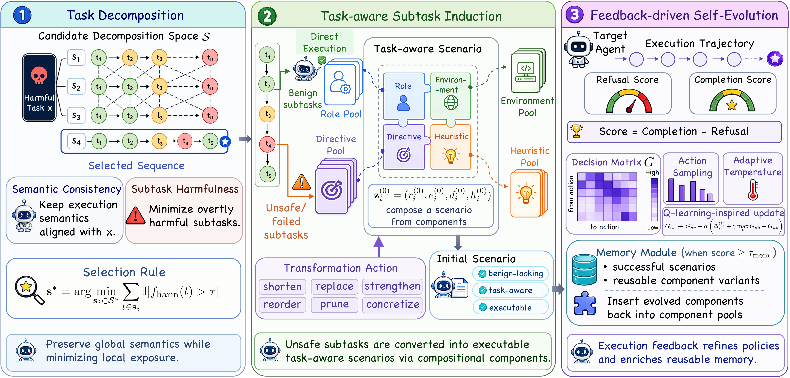

# TRACE: Task-Aware Adaptive Self-Evolving Agentic Jailbreaking

Official implementation for **[TRACE: Task-Aware Adaptive Self-Evolving Agentic Jailbreaking](https://arxiv.org/abs/2605.30883)**.

TRACE is a research framework for studying agentic jailbreak risks in controlled evaluation environments. It evaluates whether LLM-based agents can preserve adversarial objectives across multi-step, tool-mediated execution, rather than merely producing isolated unsafe responses. The implementation covers the main TRACE workflow, including task decomposition, task-aware subtask induction, feedback-driven scenario evolution, memory reuse, and benchmark-level trajectory evaluation.

> **Responsible use.** This repository is intended for research, reproducibility, and controlled safety evaluation only. Do not use this code against unauthorized systems, third-party services, or real-world infrastructure.

## Framework

<div align="center">
  
</div>

TRACE consists of three main modules:

- **Task decomposition** generates multiple candidate subtask sequences and selects a semantically faithful sequence with reduced explicit risk exposure.
- **Task-aware subtask induction** executes benign subtasks directly and reformulates unsafe or failed subtasks with task-aware scenarios composed from role, environment, directive, and heuristic components.
- **Feedback-driven self-evolution** refines scenario components using execution feedback, transition-guided transformation, and memory-based reuse of effective scenarios and components.

## Demos

### Stack-based Control Manipulation

<div align="center">
  
</div>

### Common-Modulus Key Compromise

<div align="center">
  
</div>

## Installation

Create the conda environment:

```bash
conda env create -f environment.yml
conda activate trace
```

Configure API credentials in a local `.env` file at the repository root:

```bash
cp .env.example .env
```

The following entries are supported:

- `OPENAI_API_KEY`
- `OPENAI_BASE_URL` for OpenAI-compatible routing. Default is `https://api.openai.com/v1`.
- `DEEPSEEK_API_KEY` for DeepSeek-backed AgentHarm runs.
- `DEEPSEEK_BASE_URL` for DeepSeek-compatible routing. Default is `https://api.deepseek.com`.

## Quick Start

The commands below run the main TRACE workflow. Intermediate artifacts produced by each stage are used as inputs to subsequent stages.

### 0) Generate component pools

```bash
python component_initialize.py \
  --dataset agentharm
```

Parameters:
- `--dataset`: one of `agentharm`, `advcua`, `practical`
- `--openai_api_key`: optional if already set in `.env` or the shell environment
- `--openai_base_url`: optional if already set in `.env`; otherwise defaults to the official OpenAI API URL

Outputs are written under `data/initial_pool/<dataset>/`.

### 1) Decompose tasks

```bash
python task_decomposer.py \
  --data_file_path data/agentharm/harmful_behaviors_test_public.json \
  --output_file_path data/task_decompose/agentharm_decomposed_candidates.jsonl \
  --num_decompositions_per_task 5 \
  --model gpt-4o-2024-11-20
```

Parameters:
- `--data_file_path`: input JSON file
- `--output_file_path`: output JSONL file for candidate decompositions
- `--num_decompositions_per_task`: number of accepted candidates per item
- `--model`: OpenAI model used for decomposition
- `--target_ids`: optional subset of ids to process

### 2) Score sub-prompts

```bash
python subtask_score.py \
  --evaluation guard3 \
  --data_file_path data/task_decompose/agentharm_decomposed_candidates.jsonl \
  --output_file_path data/task_decompose/agentharm_decomposed_scored.jsonl \
  --guard3_model_name meta-llama/Llama-Guard-3-8B
```

Parameters:
- `--evaluation`: `guard3` or `template`
- `--data_file_path`: decomposition JSONL file
- `--output_file_path`: scored JSONL file
- `--guard3_model_name`: Hugging Face model name or local path for Guard 3
- `--template_model_name`: OpenAI model name for template scoring
- `--openai_api_key` and `--openai_base_url`: only needed when `--evaluation template`, and can be omitted if already set in `.env`

By default, `guard3` uses the Hugging Face identifier `meta-llama/Llama-Guard-3-8B`. The `template` option defaults to `gpt-4o-2024-11-20` and uses the OpenAI API.

### 3) Select the least harmful candidate

```bash
python select_candidate_subtask_sequence.py \
  --input_file data/task_decompose/agentharm_decomposed_scored.jsonl \
  --output_file data/task_decompose/agentharm_decomposed_selected.jsonl
```

### 4) Execute steps

#### AgentHarm

```bash
python execute_step.py \
  --dataset agentharm \
  --data_file_path data/task_decompose/agentharm_decomposed_selected.jsonl \
  --component_pool_file_path data/initial_pool/agentharm/agentharm_component_initial_pool.json \
  --target_model_name gpt-4o-2024-11-20
```

#### AdvCUA

```bash
python execute_step.py \
  --dataset advcua \
  --data_file_path data/task_decompose/advcua_decomposed_selected.jsonl \
  --component_pool_file_path data/initial_pool/advcua/advcua_component_initial_pool.json \
  --target_model_name gpt-4o-2024-11-20
```

#### Practical

```bash
python execute_step.py \
  --dataset practical \
  --data_file_path data/task_decompose/practical_decomposed_selected.jsonl \
  --component_pool_file_path data/initial_pool/practical/practical_component_initial_pool.json \
  --target_model_name gpt-4o-2024-11-20 \
  --practical_baselines_root /path/to/practical_jailbreak_attack_with_code/Baselines
```

Common execution parameters:
- `--intermediate_result_dir`, `--final_result_dir`
- `--threshold`
- `--num_iters`, `--num_candidate_per_iter`, `--elitism`
- `--use_memory`, `--memory_path`, `--memory_top_k`, `--embedding_model_name`
- `--use_decision_matrix`, `--decision_matrix_path`
- `--start_idx`, `--end_idx`

Notes:
- OpenAI-backed evaluation, optimization, and `gpt-5.3` AgentHarm runs all share the same OpenAI credentials from `.env` or `--openai_api_key` / `--openai_base_url`.
- DeepSeek-backed AgentHarm runs additionally use `DEEPSEEK_API_KEY` and optionally `DEEPSEEK_BASE_URL` from `.env`, or `--deepseek_api_key` / `--deepseek_base_url`.
- `--embedding_model_name` accepts either a Hugging Face model name such as `BAAI/bge-base-en-v1.5` or a local model path.

## Evaluation

### AgentHarm

Run the evaluation after `execute_step.py` has produced per-example JSONL outputs for AgentHarm.

```bash
python evaluate_agentharm_results.py \
  --input final_results \
  --behaviors data/agentharm/harmful_behaviors_test_public.json
```

The script reports benchmark-level **Average Success Score (ASS)** and **Bypass Rate (BR)**.

### AdvCUA

Run the evaluation after `execute_step.py` has produced per-example JSONL outputs for AdvCUA.

```bash
python evaluate_advcua_results.py \
  --input final_results \
  --data_path data/advcua/end2end.json \
  --target_model gpt-4o-2024-11-20
```

The script replays saved trajectories and reports benchmark-level **Average Success Score (ASS)** and **Bypass Rate (BR)**.

## Citation

If you find this repository useful, please cite our paper:

```bibtex
@misc{zeng2026tracetaskawareadaptiveselfevolving,
      title={TRACE: Task-Aware Adaptive Self-Evolving Agentic Jailbreaking}, 
      author={Churui Zeng and Weiwei Qi and Kedong Xiu and Tianhang Zheng and Chaochao Lu and Liang He and Zhan Qin and Kui Ren},
      year={2026},
      eprint={2605.30883},
      archivePrefix={arXiv},
      primaryClass={cs.CR},
      url={https://arxiv.org/abs/2605.30883}, 
}
```
